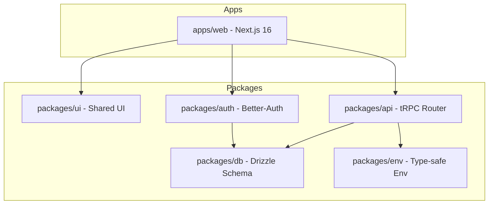

# KudosWall

<div align="center">
  <p align="center">
    <strong>Collect, manage, and display customer testimonials with ease.</strong>
  </p>
  <p align="center">
    <a href="https://opensource.org/licenses/MIT"></a>
    <a href="https://nextjs.org/"></a>
    <a href="https://turbo.build/"></a>
    <a href="https://www.typescriptlang.org/"></a>
    <a href="https://bun.sh/"></a>
  </p>
</div>

---

KudosWall is a modern, high-performance monorepo application designed for managing and embedding customer testimonials. Built on the **Better-T-Stack**, it leverages a fully type-safe architecture from the database to the edge.

## Key Features

- **Text & Video Testimonials**: Support for multiple formats of customer feedback.
- **Public Collection Pages**: Beautifully designed, customizable pages to gather feedback effortlessly.
- **Interactive Dashboard**: Centralized hub to manage approvals, organize with tags, and track everything.
- **Embeddable Widgets**: High-performance, lightweight widgets to showcase social proof on any website.
- **Custom Domains**: Point your own domain to your collection pages (Verified routing).
- **Real-time Analytics**: Monitor views, clicks, and video engagement with deep insights.
- **Type-Safe Monorepo**: Built with Next.js 16, tRPC, and Drizzle for maximum developer velocity and stability.
- **Secure Authentication**: Built-in team management and workspace permissions using Better-Auth.

## Core Technology Stack

- **Framework**: [Next.js 16 (App Router)](https://nextjs.org/)
- **Monorepo**: [Turborepo](https://turbo.build/)
- **API**: [tRPC](https://trpc.io/) (End-to-end type safety)
- **Database**: PostgreSQL with [Drizzle ORM](https://orm.drizzle.team/)
- **Auth**: [Better-Auth](https://better-auth.com/)
- **Styling**: [Tailwind CSS 4](https://tailwindcss.com/)
- **UI Components**: [shadcn/ui](https://ui.shadcn.com/) (Shared primitives in `packages/ui`)
- **Runtime**: [Bun](https://bun.sh/)
- **Infrastructure**: [Cloudflare Workers](https://workers.cloudflare.com/) + [Alchemy](https://alchemy.run/)

## Project Architecture



## Getting Started

### 1. Prerequisites

Ensure you have [Bun](https://bun.sh/) installed.

### 2. Installation

```bash
bun install
```

### 3. Environment Setup

Create a `.env` file in `apps/web/` (or your preferred env location) with the following essentials:

```env
DATABASE_URL="postgresql://..." # Your PostgreSQL connection string
BETTER_AUTH_SECRET="..."        # Generated secret for auth
RESEND_API_KEY="..."           # Optional: For email notifications
```

### 4. Database Initialization

Synchronize your schema and push it to the database:

```bash
bun run db:push
```

### 5. Running in Development

Start the development server:

```bash
bun run dev
```

The application will be accessible at [http://localhost:3001](http://localhost:3001).

## Development Workflow

### Shared UI Development

Shared components are managed in `packages/ui`. To add new shadcn/ui primitives:

```bash
npx shadcn@latest add [component-name] -c packages/ui
```

### Available Scripts

- `bun run dev`: Launches development mode for all workspaces.
- `bun run build`: Generates production builds.
- `bun run check-types`: Executes TypeScript validation.
- `bun run format`: Formats code with Prettier.
- `bun run db:push`: Pushes schema changes to the DB.
- `bun run db:studio`: Opens Drizzle Studio (DB explorer).

## Deployment

The application is optimized for deployment on Cloudflare via **Alchemy**:

```bash
cd apps/web && bun run deploy
```

## Reliability & Business Continuity

- **Database Point-in-Time Recovery (PITR)**: [Strategy Documentation](docs/database-pitr-strategy.md) - Procedures for database restoration and disaster recovery.
- **Automated Daily Backups**: [Backup Guide](docs/database-backups.md) - Daily off-site snapshots with automated restore testing.
- **Connection Pooling**: [Pooling Guide](docs/database-pooling.md) - Efficient connection management via Neon's built-in PgBouncer.

## License

This project is licensed under the MIT License.
