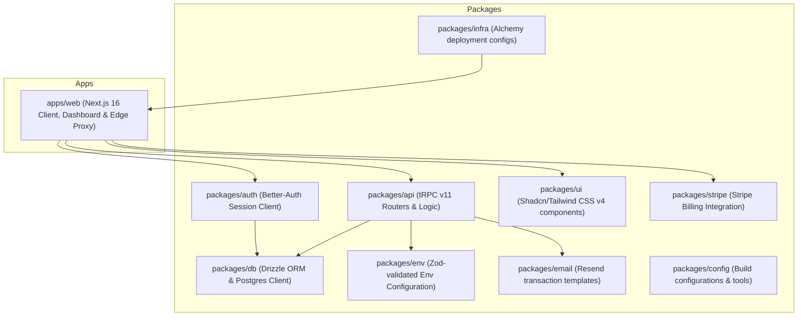
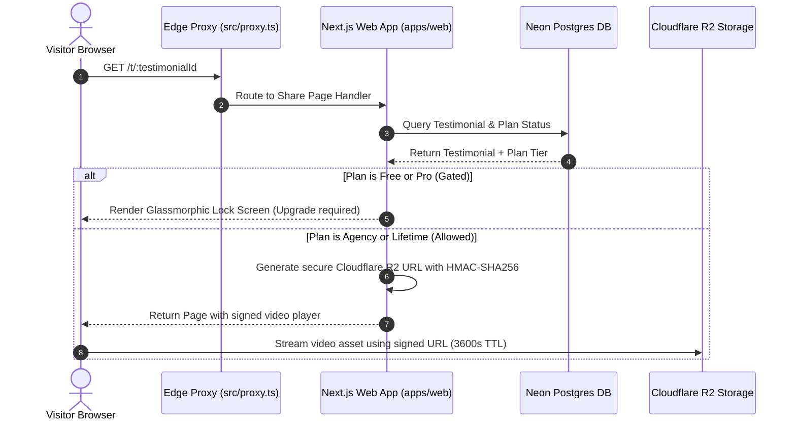

# KudosWall 💖

<div align="center">
  <p align="center">
    <strong>Collect, manage, and embed stunning customer testimonials in under 3 minutes.</strong>
  </p>
  <p align="center">
    <a href="https://opensource.org/licenses/MIT"></a>
    <a href="https://nextjs.org/"></a>
    <a href="https://turbo.build/"></a>
    <a href="https://www.typescriptlang.org/"></a>
    <a href="https://bun.sh/"></a>
    <a href="https://orm.drizzle.team/"></a>
    <a href="https://tailwindcss.com/"></a>
    <a href="https://better-auth.com/"></a>
  </p>
</div>

---

## 💎 Table of Contents

- [1. About KudosWall](#1-about-kudoswall)
- [2. Features](#2-features)
- [3. System & Monorepo Architecture](#3-system--monorepo-architecture)
  - [3.1 Dependency Mapping](#31-dependency-mapping)
  - [3.2 Edge Request Proxy & Media Signing Sequence](#32-edge-request-proxy--media-signing-sequence)
- [4. Monorepo Structure Reference](#4-monorepo-structure-reference)
- [5. Getting Started](#5-getting-started)
  - [5.1 Prerequisites](#51-prerequisites)
  - [5.2 Installation](#52-installation)
  - [5.3 Environment Configuration Matrix](#53-environment-configuration-matrix)
  - [5.4 Database Initialisation](#54-database-initialisation)
  - [5.5 Launching the Development Server](#55-launching-the-development-server)
- [6. Master Tutorial: From Zero to Hero](#6-master-tutorial-from-zero-to-hero)
- [7. Quality Standards & Dev Scripts](#7-quality-standards--dev-scripts)
- [8. Documentation Index & Operational Guides](#8-documentation-index--operational-guides)
- [9. License](#9-license)

---

## 1. About KudosWall

KudosWall is an elite, high-performance monorepo SaaS application designed for collecting, managing, and embedding customer testimonials (both text and video). Built on a fully type-safe stack, it features a pipeline extending from database columns through server routers down to native UI client elements.

By leveraging edge-compatible Next.js 16 proxies, serverless PostgreSQL connection pooling, and HMAC-signed media delivery, KudosWall bridges the gap between raw web speed and rock-solid enterprise reliability.

---

## 2. Features

- 🎥 **Interactive Testimonial Forms**: Collect rich 5-star ratings, high-fidelity browser audio/video recordings, and avatar profile uploads.
- 🎨 **White-labeled Campaigns**: Customize and brand each collection page with custom logos, background gradients, custom typography (35+ Google Fonts), and override CSS.
- ⌨️ **Keyboard-Driven Triage**: Navigate the inbox using advanced keyboard hotkeys (`J`/`K` to step/highlight, `A` to approve, `R` to reject).
- 🔒 **Secure R2 Media CDN**: Play video testimonials securely using temporary signed paths powered by Cloudflare R2 and HMAC-SHA256 tokens.
- 💳 **Plan-Gated Feature System**: Enforce limits on projects, testimonials, and video options using Stripe billing states across Free, Pro, Agency, and Lifetime tiers.
- 🚀 **Next.js 16 Edge Proxy**: Zero-latency edge requests routed via a lightweight serverless proxy handler (`src/proxy.ts`).
- 🔍 **SEO & JSON-LD Injection**: Out-of-the-box metadata tagging and structured review schema injection for Google search visibility.

---

## 3. System & Monorepo Architecture

### 3.1 Dependency Mapping

KudosWall uses Turborepo to govern a clean, decoupled workspace layer:



### 3.2 Edge Request Proxy & Media Signing Sequence

When a visitor requests testimonial sharing or media playback:



---

## 4. Monorepo Structure Reference

```
├── apps
│   └── web                  # Next.js 16 app (Dashboard, Collections, Proxy Router)
├── packages
│   ├── api                  # tRPC procedures, input validators, business logic
│   ├── auth                 # Better-Auth security configuration and sessions
│   ├── config               # Base configs for Tailwind, PostCSS, ESLint, TypeScript
│   ├── db                   # Database schema definitions and Neon client
│   ├── email                # Outbound transactional email templates (Resend)
│   ├── env                  # Safe environment variables loader (Zod)
│   ├── infra                # Cloudflare Pages / Workers IaC and deployment
│   ├── stripe               # Subscription lifecycle, pricing, webhooks
│   └── ui                   # Shared HSL design system and React primitives
```

---

## 5. Getting Started

### 5.1 Prerequisites

Ensure you have **[Bun](https://bun.sh/)** v1.3.0 or higher installed.

### 5.2 Installation

Clone the repository and run the installation script:

```bash
bun install
```

### 5.3 Environment Configuration Matrix

Create a `.env` file in your project root using the reference below:

| Environment Variable                 | Target Scope | Required | Purpose / Notes                                       |
| :----------------------------------- | :----------- | :------: | :---------------------------------------------------- |
| `DATABASE_URL`                       | Server       | **Yes**  | Neon serverless PostgreSQL connection string          |
| `DATABASE_READ_URL`                  | Server       |    No    | Optional replica endpoint for high-scale widget reads |
| `BETTER_AUTH_SECRET`                 | Server       | **Yes**  | Encryption token secret for Better-Auth sessions      |
| `R2_SIGNING_SECRET`                  | Server       | **Yes**  | Secret seed key (HMAC-SHA256) for signed media URLs   |
| `GOOGLE_CLIENT_ID`                   | Server       |    No    | Google OAuth App Client ID                            |
| `GOOGLE_CLIENT_SECRET`               | Server       |    No    | Google OAuth App Client Secret                        |
| `LINKEDIN_CLIENT_ID`                 | Server       |    No    | LinkedIn OAuth App Client ID                          |
| `LINKEDIN_CLIENT_SECRET`             | Server       |    No    | LinkedIn OAuth App Client Secret                      |
| `RESEND_API_KEY`                     | Server       |    No    | Resend API token for transactional emails             |
| `EMAIL_FROM`                         | Server       |    No    | Sender address for system transactional emails        |
| `STRIPE_SECRET_KEY`                  | Server       | **Yes**  | Stripe back-end secret API key                        |
| `STRIPE_WEBHOOK_SECRET`              | Server       | **Yes**  | Webhook verification signature from Stripe            |
| `NEXT_PUBLIC_STRIPE_PUBLISHABLE_KEY` | Client       | **Yes**  | Stripe client-side SDK Gateway key                    |
| `NEXT_PUBLIC_ENABLE_VIDEO`           | Client       |    No    | Configuration toggle for browser video recording      |

> [!NOTE]
> All schema and environment variables are strictly validated at compilation time using Zod via `@my-better-t-app/env`.

### 5.4 Database Initialisation

Push schemas, generate database structures, and configure migrations using Drizzle:

```bash
# Push schema changes directly to your database instance
bun run db:push

# Generate SQL migration scripts
bun run db:generate

# Execute pending database migrations
bun run db:migrate
```

To explore the database table states visually, launch Drizzle Studio:

```bash
bun run db:studio
```

### 5.5 Launching the Development Server

Start the Turborepo local development tasks:

```bash
bun run dev
```

The main web dashboard will launch at **[http://localhost:3000](http://localhost:3000)**.

---

## 6. Master Tutorial: From Zero to Hero

Here's how to collect and display your first customer testimonial in under 3 minutes.

### Step 1: Create a Collection Campaign

1. Log in to your KudosWall dashboard at `/dashboard`.
2. Click **Create Collection**. Set the name to `"Acme Launch Campaign"`, select your typography, and upload a branding logo.
3. Save the collection to generate a public collection slug: `acme-launch`.

### Step 2: Submit a Testimonial (Visitor's Flow)

1. Navigate to the public page: `http://localhost:3000/collect/acme-launch`.
2. Click **Write a Testimonial**. Enter a star rating, type out your review text, upload a profile avatar, and click **Submit**.
3. The review will land inside the workspace inbox in a `pending` state.

### Step 3: Approve and Share (Dashboard Flow)

1. Open your Inbox at `/dashboard/testimonials`.
2. Find the pending review. Use your keyboard: press `J` or `K` to highlight it, and press `A` to instantly **Approve** it.
3. Click **Copy Share Link** to grab the public `/t/[id]` link. 5-star verified social proof is now ready for your sales page!

---

## 7. Quality Standards & Dev Scripts

Ensure code consistency, formatting rules, and type boundaries before committing changes:

- **Format Code**: `bun run format` (Uses Prettier with Tailwind CSS integration)
- **Type Checking**: `bun run check-types` (Strict TypeScript compiler checking)
- **Production Build**: `bun run build` (Compiles edge bundles to verify zero build errors)
- **E2E Testing**: `bun run test:e2e` (Launches Playwright E2E browser tests)

---

## 8. Documentation Index & Operational Guides

To explore advanced setups, database backup structures, and system configurations, check out the specialized guides:

- 📑 **[Diátaxis Documentation Index](docs/DIATAXIS.md)** - A structured categorization map of all guides.
- 🗺️ **[System State & Roadmap](docs/current_project_state.md)** - Visual Mermaid workflows and project roadmap details.
- 🛡️ **[Database Point-in-Time Recovery (PITR)](docs/database-pitr-strategy.md)** - Detailed PG transaction restoration procedures.
- 🗄️ **[Neon Connection Pooling](docs/database-pooling.md)** - Technical details on scaling serverless Postgres active pools.
- 📊 **[Database Partitioning Strategy](docs/database-partitioning.md)** - Schema partitioning for high-scale data.
- 💾 **[Database Backup Architecture](docs/database-backups.md)** - Daily backup configuration mapping.
- 📈 **[SEO Campaign Roadmap](docs/seo_plan.md)** - Organic growth mapping and metadata schema tracking.
- 💳 **[Stripe Integration Architecture](docs/stripe-implementation-plan.md)** - Pricing and feature-gating lifecycle logic.

---

## 9. License

This repository is licensed under the MIT License. See [LICENSE](LICENSE) for more information.
