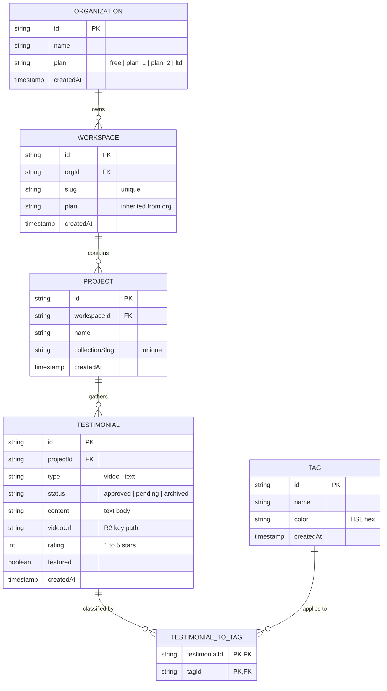
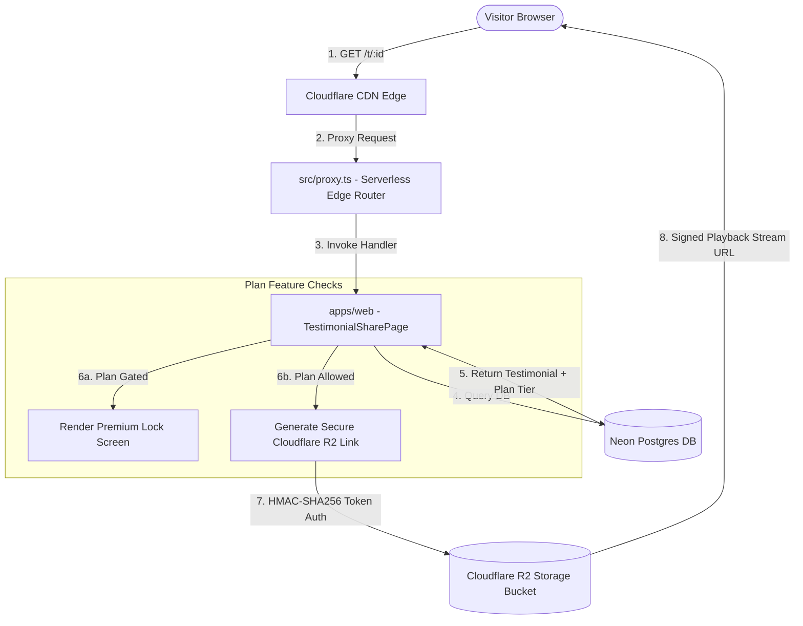

# KudosWall: Current Project State & Architectural Roadmap

This document serves as the high-fidelity engineering manifest for **KudosWall**. It outlines our active system metrics, runtime architecture, data-flow models, environment matrices, and our multi-month execution roadmap.

---

## 1. System Status & Technical Core

- **Repository Type**: Turborepo Monorepo
- **Runtime Engine**: Bun v1.1+ (TypeScript Native)
- **Database Engine**: Neon PostgreSQL (Serverless) + Drizzle ORM
- **Edge/CDN Delivery**: Cloudflare Workers + Alchemy Serverless Router
- **Media Cache Store**: Cloudflare R2 Storage (HMAC-SHA256 Signed Paths)
- **Authentication Hub**: Better-Auth (Server/Client Session Synchronization)

---

## 2. Interactive System Flows & Diagrams

### 2.1 Complete Entity Relationship Model (ERD)



### 2.2 Edge Request Proxy & Media Signing Pipeline

When a user requests a single testimonial review or a media playback session:



---

## 3. Standardized System Configurations (JSON Manifest)

The following JSON schema dictates our global runtime limits and feature flags:

```json
{
  "$schema": "https://kudoswall.com/schemas/system-state.v1.json",
  "environment": "production",
  "stack": {
    "framework": "Next.js 16 (App Router)",
    "monorepo": "Turborepo v2.9",
    "packageManager": "Bun v1.1.20"
  },
  "plans": {
    "free": {
      "limits": {
        "maxProjects": 1,
        "maxTestimonials": 10
      },
      "features": {
        "video": false,
        "tagging": false,
        "tagFiltering": false,
        "singleTestimonialShare": false
      }
    },
    "plan_1_pro": {
      "limits": {
        "maxProjects": 3,
        "maxTestimonials": 100
      },
      "features": {
        "video": true,
        "tagging": true,
        "tagFiltering": true,
        "singleTestimonialShare": false
      }
    },
    "plan_2_agency": {
      "limits": {
        "maxProjects": 10,
        "maxTestimonials": 1000
      },
      "features": {
        "video": true,
        "tagging": true,
        "tagFiltering": true,
        "singleTestimonialShare": true
      }
    },
    "plan_ltd_lifetime": {
      "limits": {
        "maxProjects": 9999,
        "maxTestimonials": 99999
      },
      "features": {
        "video": true,
        "tagging": true,
        "tagFiltering": true,
        "singleTestimonialShare": true
      }
    }
  },
  "security": {
    "mediaAccess": "Cloudflare R2 signed-url with HMAC-SHA256 (3600s TTL)",
    "encryption": "Node crypto web standard",
    "hashing": "bcrypt"
  }
}
```

---

## 4. Multi-Month Execution Roadmap

```
  Phase 1: Foundation (Done)      Phase 2: Sharing & Core (Active)     Phase 3: Analytics (Upcoming)
 ┌───────────────────────────┐   ┌──────────────────────────────┐   ┌───────────────────────────────┐
 │ • Setup Monorepo Schema   │   │ • Gated Single Share Link    │   │ • Drop-Off Submission Heatmaps│
 │ • Better-Auth Engine      │   │ • R2 Media Signing Pipeline  │   │ • CSAT Dashboard Metrics      │
 │ • Collection Form Engine  │   │ • Ergonomic Keyboard Actions │   │ • Automatic Email Outreach   │
 └───────────────────────────┘   └──────────────────────────────┘   └───────────────────────────────┘
```

### 🗓️ Month 1: Core Foundation & Form Campaigns (Completed)

- **Database Framework**: Architected tables and index boundaries using Drizzle.
- **Authentication & Organization**: Integrated Better-Auth for serverless organization mapping and login.
- **Dynamic Collection Engine**: Completed visual form configurations with custom branding options (Logo, primary brand colors, typography).

### 🗓️ Month 2: Pro Features, Sharing & Keyboard Navigation (Current)

- **Premium Feature Gate**: Gated single-testimonial share actions to **Agency** (`plan_2`) and **Lifetime** (`ltd`) plan workspaces.
- **Edge Protected Pages**: Implemented dynamic `/t/[id]` sales pages with Cloudflare R2 secure signed video URLs, verified badges, and search engine SEO mapping.
- **Premium Upgrade Lock Screen**: Formulated a high-fidelity glassmorphic screen showing when free/pro workspaces attempt unauthorized share page loading.
- **Supercharged Dashboard UX**:
  - Implemented `J`/`K` navigation controls for rapid keyboard triage.
  - Added standard hotkeys (`A` to approve, `R` to archive, `S` to star/feature).
  - Constructed a detailed "Shortcuts Help Modal" (`?` key) to list hotkeys.

### 🗓️ Month 3: Campaigns, Analytics & Automation (Upcoming)

- **Collection Analytics**: Track submission funnel completion rates, drop-off heatmaps, and load durations.
- **Testimonial Request Campaigns**: Schedule sequence campaigns via Resend (Day 0 welcome, Day 3 reminder, Day 7 final follow-up).
- **Customer CSAT aggregation**: Standardize and charts metrics across all client projects on a single screen.
